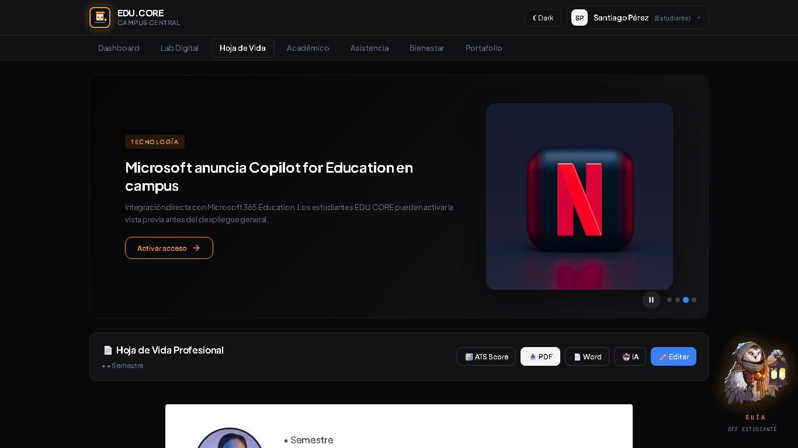

# EDU.CORE · Plataforma Integral de Gestión y Acompañamiento Estudiantil

[](https://github.com/Marusan94/plataforma-estudiantil)
[]()
[]()
[]()
[]()
[]()
[]()
[]()
[]()
[]()
[]()

> **Plataforma web integral** para la gestión académica, social y analítica de estudiantes universitarios. Backend desacoplado en **Spring Boot 3**, frontend moderno en **React 18 + Vite** y módulo de analítica en **Python/Pandas**, con interfaces diferenciadas por rol, mascotas guía pixel-art con IA proactiva y **Lab Digital** con sistema de tickets tipo real.

---

## 📸 Capturas de Pantalla

### 🏠 Dashboard Principal (Estudiante)

*Dashboard personal con métricas académicas, slider de noticias por rol y acceso rápido a módulos*

### 🎫 Lab Digital - Vista Tickets

*Sistema de tickets tipo real: búsqueda, filtros, 24 retos generados desde módulos de cursos*

### 📋 Hoja de Vida Profesional

*CV profesional con descarga PDF/Word, análisis ATS, asistente IA y secciones completas*

### 🎫 Ticket Modal - Experiencia Inmersiva

*Ticket tipo real: descripción, base de conocimiento, editor, terminal y acreditación*

### 🎓 Roles: Docente, Familiar, Bienestar, Admin
| Docente | Familiar | Bienestar | Admin |
|---|---|---|---|
|  |  |  |  |

### 🌙 Modo Lovecraft - Portafolio Público

*Tema dark futurista Lovecraftiano con efectos glitch, scanlines CRT, nebulosas animadas*

### 🤖 Mascotas Guía Pixel-Art

*Búho con farol y Capibara profesor: sprites 6-frames, patrullaje, burbujas RPG, voz TTS, XP*

---

## ✨ Características Principales

| Módulo | Descripción | Highlights |
|---|---|---|
| 📰 **Slider de Noticias por Rol** | Carrusel auto-play con noticias IA, tech, educación + certificados gratuitos (NVIDIA, Google, Microsoft). Contenido único por rol. | Auto-play, pausable, navegación por teclado, imágenes lazy-load |
| 👥 **Interfaces por Rol** | 5 roles (Estudiante, Docente, Familiar, Bienestar, Admin) con tabs, dashboards y permisos únicos. | Cambio instantáneo sin login, persistencia localStorage |
| 🤖 **Mascotas Guía Pixel-Art** | Búho (general) y Capibara (docente): sprites 6-frames, patrullaje, burbujas RPG estilo Pokémon, TTS, decisiones proactivas con XP. | 3 tipos de decisión (alerta, recomendación, recordatorio), voz sintetizada, minimizable |
| 🎫 **Lab Digital - Sistema de Tickets** | 24 tickets generados desde módulos de 6 cursos gratuitos (FreeCodeCamp, CS50, Kaggle, Baeldung, Linux Foundation, GitHub Skills). Búsqueda, filtros, modal inmersivo. | Base de conocimiento simulada, editor Monaco-style, terminal V8, acreditación 1-click |
| 📋 **Hoja de Vida Profesional** | CV completo: header con foto, resumen, habilidades (tech/soft), experiencia, proyectos con links, certificaciones, intereses. **Descarga PDF (html2pdf), Word (docx), análisis ATS scoring, asistente IA chat.** | ATS scoring 0-100, sugerencias contextuales, asistente IA con chat, template profesional |
| 📚 **Académico & Notas** | Notas por materia/grupo, alertas académicas automáticas (< 3.0), recomendaciones personalizadas. | Filtros, exportación, historial |
| ✅ **Asistencia Inteligente** | **Estudiante ve solo SU asistencia** (read-only). Docente/Admin: planilla completa editable (Presente/Ausente/Justificado), guardado lote. | Filtrado por rol, observaciones, % global por materia |
| 🏥 **Bienestar & Triage** | Tickets con prioridad (ALTA/MEDIA/BAJA), SLA automático, seguimientos, alertas tempranas riesgo académico. | Kanban, asignación profesional, narrativa impacto |
| 👨‍👩‍👧 **Portal Familiar** | Seguimiento acudiente: boletín notas, alertas crítico (< 3.0), asistencia global, comunicación. | Solo lectura, vinculado a estudiante |
| 📊 **Analítica Python + Vista SaaS** | Correlación asistencia/nota, histogramas acceso familiar, retención, SLA bienestar, narrativa impacto. Exporta PNG/CSV. | Pandas, NumPy, SciPy, Matplotlib, Seaborn |

---

## 🏗️ Arquitectura

```
plataforma-estudiantil/
├── backend/                      # Spring Boot 3.3.4 · Java 17 · JPA · H2
│   └── src/main/java/com/edu/plataforma/
│       ├── config/               # CORS, DataLoader (datos demo)
│       ├── controller/           # REST: usuarios, estudiantes, notas, asistencias, dashboard
│       ├── dto/                  # DTOs con Bean Validation
│       ├── exception/            # GlobalExceptionHandler
│       ├── model/                # Entidades JPA
│       ├── repository/           # Repositorios + queries avanzadas
│       └── service/              # Lógica de negocio
├── frontend/                     # React 18 + Vite · SPA dark/light
│   └── src/
│       ├── components/           # Vistas: Dashboard, LabDigital, HojaVida, Asistencia, Academico, Bienestar, Familiar, Registro, Navbar, NewsSlider, CopilotWidget
│       ├── services/             # api.js (fetch con fallback local + timeout 3s)
│       ├── App.jsx               # Router + roles + theme
│       └── index.css             # Design system completo (CSS vars, lovecraft theme)
├── data-analysis/                # Python 3.12 · Pandas · NumPy · SciPy
│   ├── scripts/                  # Análisis: registro, notas, asistencia, bienestar
│   ├── reports/                  # PNG + CSV generados
│   └── run_all_analysis.py       # Orquestador
├── render.yaml                   # Blueprint Render (backend + frontend + cron)
├── iniciar_plataforma.bat        # Arranque Windows (backend + frontend + análisis)
├── DESIGN.md                     # Design system documentado
└── ROBOT_AI_PAPER*.md            # Especificación asistente IA
```

---

## 🛠️ Stack Tecnológico

| Capa | Tecnologías |
|---|---|
| **Backend** | Spring Boot 3.3.4, Java 17, Spring Data JPA, H2 (mem), Bean Validation, Maven |
| **Frontend** | React 18, Vite 5, React Router, CSS Variables Design System, html2pdf.js, docx, file-saver |
| **Analítica** | Python 3.12, Pandas, NumPy, SciPy, Matplotlib, Seaborn |
| **Deploy** | Render (Blueprint), Docker-ready, cron jobs para keep-alive |
| **Dev Tools** | Maven, npm, Git, VS Code |

---

## 🚀 Puesta en Marcha

### Prerrequisitos
- **Java 17+** y **Maven 3.9+**
- **Node 18+** y **npm 9+**
- **Python 3.10+** (para analítica)

### Opción 1 · Script Automatizado (Windows)
```bash
# Doble clic en la raíz del proyecto
iniciar_plataforma.bat
```
> Levanta backend (8080), frontend (5173) y analítica en ventanas separadas.

### Opción 2 · Manual (Multi-plataforma)

**Backend** — API `http://localhost:8080` | H2 Console `http://localhost:8080/h2-console`
```bash
cd backend
mvn spring-boot:run
```
*JDBC: `jdbc:h2:mem:edudb` | User: `sa` | Pass: *(vacío)*

**Frontend** — App `http://localhost:5173`
```bash
cd frontend
npm install
npm run dev
```

**Analítica** — Reportes en `data-analysis/reports/`
```bash
cd data-analysis
python run_all_analysis.py
```

### Opción 3 · Deploy en Render (1-click)
[](https://render.com/deploy?repo=https://github.com/Marusan94/plataforma-estudiantil)

El `render.yaml` incluido crea:
- **Backend**: Web Service (Java, Maven, puerto 8080)
- **Frontend**: Static Site (Vite build, puerto 5173)
- **Cron Job**: Keep-alive cada 5 min (evita cold-start en plan gratis)

---

## 👥 Roles de Demostración

Cambia de rol **instantáneamente** desde el avatar (arriba a la derecha) — sin login, persiste en localStorage.

| Rol | Accesos | Mascota |
|---|---|---|
| **Estudiante** | Dashboard, Lab Digital, Hoja de Vida, Académico, Asistencia, Bienestar | 🦉 Búho |
| **Docente** | Dashboard, Lab Digital, Académico, Asistencia, Bienestar, Registro | 🦫 Capibara |
| **Familiar** | Dashboard, Familiar, Bienestar | — |
| **Bienestar** | Dashboard, Bienestar, Asistencia, Registro | 🦉 Búho |
| **Admin** | **Todo** + Vista Ejecutiva SaaS | 🦉 Búho |

---

## 🤖 Mascotas Guía — Detalle Técnico

| Característica | Búho (Estudiante) | Capibara (Docente) |
|---|---|---|
| **Sprite** | 6 frames (144×144) | 6 frames (144×144) |
| **Animaciones** | Quieto, caminar (4), volar (2) | Quieto, caminar (4), volar (2) |
| **Comportamiento** | Patrullaje aleatorio, bob idle | Patrullaje, sigue cursor ocasionalmente |
| **Burbuja RPG** | Máquina de escribir, decisiones coloreadas | Igual + iconos académicos |
| **Decisiones** | Alerta 🔴, Recomendación 🟡, Recordatorio 🔵, Oportunidad 🟢 | + Triage 🩷, Seguimiento 🔵, Métrica 🟡 |
| **Voz (TTS)** | `♪ Hablar` — Web Speech API | Igual |
| **XP System** | +10 por decisión, nivel cada 100 | Igual |
| **Controles** | Minimizar, OFF por rol, Restaurar | Igual |

---

## 📋 Hoja de Vida — Feature Completa

La **Hoja de Vida** no es un simple formulario — es un **generador de CV profesional** listo para usar:

### 🎯 Secciones Incluidas
| Sección | Campos | Detalle |
|---|---|---|
| **Header** | Foto, Nombre, Programa, Semestre, Email, ID | Foto editable (drag & drop / click) |
| **Resumen Profesional** | Textarea libre | 200-500 chars recomendado |
| **Habilidades** | Array dinámico | Nombre, Nivel (Básico/Intermedio/Avanzado/Experto), Tipo (Técnica/Blanda) — badges coloreados |
| **Experiencia** | Textarea + proyectos | Formato libre + proyectos estructurados |
| **Proyectos** | Título, Descripción, Tech Stack, URL GitHub/Demo | Cards con link externo |
| **Certificaciones** | Nombre, Institución, Fecha, URL archivo | Badge + link verificación |
| **Intereses** | Textarea | Tags visuales |

### ⚡ Features Avanzadas
| Feature | Descripción |
|---|---|
| **📥 Descarga PDF** | `html2pdf.js` — layout profesional, página A4, márgenes, saltos de página inteligentes |
| **📄 Descarga Word** | `docx` — estructura DOCX nativa: headings, tablas, links, formato ATS-friendly |
| **📊 Análisis ATS** | Scoring 0-100 basado en: resumen (>100 chars), ≥5 skills, experiencia, ≥2 proyectos, ≥1 certificación. Sugerencias accionables en banner. |
| **🤖 Asistente IA Integrado** | Chat contextual en la pestaña: pide "análisis ATS", "mejora skills", "palabras clave backend", "formato senior". Respuestas simuladas con tips reales. |
| **✏️ Edición Inline** | Modal con validación, preview foto, guardado optimista + toast |

### 🎨 Vista Previa del CV Generado
```
┌─────────────────────────────────────────────────────────────┐
│  📷 SANTIAGO PÉREZ                                          │
│  Ingeniería de Sistemas • Semestre 7 • santiago@edu.co      │
├─────────────────────────────────────────────────────────────┤
│  RESUMEN PROFESIONAL                                        │
│  Estudiante apasionado por desarrollo fullstack con Spring  │
│  Boot y React. Enfocado en soluciones limpias y escalables. │
├─────────────────────────────────────────────────────────────┤
│  HABILIDADES Y COMPETENCIAS                                 │
│  Técnicas:  Java & Spring Boot (Avanzado)  React & Tailwind │
│             (Avanzado)  SQL/PostgreSQL (Intermedio)         │
│  Blandas:   Trabajo en Equipo (Avanzado)  Resolución        │
│             Problemas (Avanzado)                            │
├─────────────────────────────────────────────────────────────┤
│  EXPERIENCIA Y PROYECTOS                                    │
│  Monitor académico Algoritmos 2025. Desarrollador Jr...     │
│  🚀 E-commerce Educativo  [React, Spring Boot, PostgreSQL]  │
│  🚀 App Asistencia QR      [React Native, Node.js, SQLite]  │
├─────────────────────────────────────────────────────────────┤
│  CERTIFICACIONES                                            │
│  🏆 Oracle Certified Professional: Java SE 17  (2025)       │
│  ☁️ AWS Solutions Architect Associate        (2024)         │
│  🧠 TensorFlow Developer Certificate          (2025)        │
└─────────────────────────────────────────────────────────────┘
ATS Score: 95/100  ✓ Listo para aplicar
```

---

## 🎫 Lab Digital — Sistema de Tickets

### Flujo de Trabajo
```
1. 📋 Vista Tickets          → Busca por título/curso/tag (ej: "filter", "docker", "SQL")
2. 🏷️ Filtra por Categoría   → Web / Backend / Data-AI / DevOps / Tools / CS-Core
3. 🎫 Click Ticket           → Abre modal inmersivo
4. 🔍 Base de Conocimiento   → Pistas contextuales + link a docs oficiales
5. ⌨️ Escribe Script         → Editor con código inicial, syntax highlighting
6. ▶ Ejecutar                → Terminal V8 real (Function constructor + console.log capture)
7. 🏆 Acreditar              → Guarda en Hoja de Vida + localStorage + toast
```

### 6 Cursos → 24 Tickets Generados
| Curso | Proveedor | Categoría | Módulos → Tickets |
|---|---|---|---|
| Desarrollo Web Full Stack | FreeCodeCamp | WEB | 4 |
| CS50: Intro CS | Harvard/edX | CS-CORE | 4 |
| Python Data & ML | Kaggle | DATA-AI | 4 |
| Backend Spring Boot | Baeldung | BACKEND | 4 |
| Linux & Bash | Linux Foundation | DEVOPS | 4 |
| Git & GitHub CLI | GitHub Skills | TOOLS | 4 |

---

## 🌙 Portafolio Público — Tema Lovecraftiano

Accesible desde la pestaña **Portafolio** (todos los roles).

### Estética Cosmic Horror
- **Paleta**: Verde Cthulhu (`#00ff88`), Púrpura Eldritch (`#b866ff`), Oro Miskatonic (`#c9a84c`), Rojo Arkham (`#cc3333`)
- **Efectos**: Glitch text (CSS animations), Scanlines CRT, Vignette, Partículas estelares, Nebulosas animadas, Bordes fluidos
- **Interacciones**: Hover cards (scale + glow), Botones eldritch (gradientes animados), Runas pulsantes, Tooltips "conocimiento prohibido"

### Contenido
- Hero con glitch-text animado + stats
- About con métricas (6+ proyectos, 3+ años, 12+ techs, 6 certs)
- Skills grid (6 categorías, 35+ tecnologías)
- Proyectos destacables (6 cards con iconos, tags, links código/demo)
- Certificaciones (6 badges animados)
- Formación + Experiencia + Contacto (Email, Calendly)
- Necronomicon-style CTA con aura animada

---

## 📁 Estructura de Carpetas Completa

```
plataforma-estudiantil/
├── backend/
│   ├── pom.xml
│   └── src/main/java/com/edu/plataforma/
│       ├── PlataformaApplication.java
│       ├── config/{CorsConfig, DataLoader}
│       ├── controller/{AuthController, DashboardController, EstudianteController, ...}
│       ├── dto/{EstudianteDTO, NotaDTO, AsistenciaDTO, ...}
│       ├── exception/GlobalExceptionHandler.java
│       ├── model/{Estudiante, Nota, Asistencia, SolicitudBienestar, PerfilEstudiante, ...}
│       ├── repository/{EstudianteRepository, NotaRepository, ...}
│       └── service/{EstudianteService, NotaService, ...}
├── frontend/
│   ├── package.json
│   ├── vite.config.js
│   ├── index.html
│   └── src/
│       ├── main.jsx
│       ├── App.jsx
│       ├── App.css
│       ├── index.css          # 3200+ líneas: design system + lovecraft theme + ticket styles
│       ├── assets/{hero.png, react.svg}
│       ├── components/
│       │   ├── DashboardView.jsx
│       │   ├── LabDigitalView.jsx      # ← 570 líneas: tickets, sandbox, modal
│       │   ├── HojaVidaView.jsx        # ← 450 líneas: CV, PDF, Word, ATS, IA
│       │   ├── AsistenciaView.jsx      # ← Filtrado por rol
│       │   ├── AcademicoView.jsx
│       │   ├── BienestarView.jsx
│       │   ├── FamiliarView.jsx
│       │   ├── RegistroView.jsx
│       │   ├── Navbar.jsx              # ← Portafolio tab + roles
│       │   ├── NewsSlider.jsx
│       │   ├── CopilotWidget.jsx       # ← Mascotas + chat
│       │   ├── PublicPortfolio.jsx     # ← 430 líneas: Lovecraft theme
│       │   └── ...
│       └── services/api.js             # ← fetch con fallback + timeout
├── data-analysis/
│   ├── scripts/{analisis_registro.py, analisis_notas.py, ...}
│   ├── reports/           # PNG + CSV
│   └── run_all_analysis.py
├── render.yaml
├── iniciar_plataforma.bat
├── DESIGN.md
├── ROBOT_AI_PAPER.md
└── ROBOT_AI_PAPER_FULL.md
```

---

## 🧪 Testing & Calidad

```bash
# Frontend
cd frontend
npm run build          # Build producción (✅ pasa)
npm run lint           # ESLint (configurar)
npm run preview        # Preview build

# Backend
cd backend
mvn test               # JUnit tests
mvn verify             # Compile + test + verify

# Analítica
cd data-analysis
python run_all_analysis.py
```

---

## 📈 Roadmap

- [ ] **IA Real**: Conectar CopilotWidget a Gemini/OpenAI vía Spring Boot endpoint
- [ ] **Quiz Adaptativo**: Lab Digital con preguntas dinámicas según desempeño
- [ ] **Detección Plagio**: Similitud en entregas (AST + embeddings)
- [ ] **Digest Semanal**: Email automático a acudientes (SendGrid/Resend)
- [ ] **SSO Enterprise**: Google Workspace / Microsoft Entra ID (Spring Security OAuth2)
- [ ] **PostgreSQL Prod**: Migración H2 → PostgreSQL (Flyway migrations)
- [ ] **WebSockets**: Notificaciones real-time (STOMP + SockJS)
- [ ] **PWA**: Service Worker + manifest + offline-first Lab Digital
- [ ] **i18n**: Español/Inglés/Portugués (i18next)

---

## 🤝 Contribuir

```bash
# 1. Fork
# 2. Rama feature
git checkout -b feature/nueva-funcionalidad

# 3. Commit semántico
git commit -m "feat(lab-digital): add collaborative editing to sandbox"

# 4. Push + PR
git push origin feature/nueva-funcionalidad
```

### Convenciones
- **Commits**: [Conventional Commits](https://www.conventionalcommits.org/) (`feat:`, `fix:`, `docs:`, `refactor:`, `style:`, `test:`, `chore:`)
- **CSS**: BEM + CSS Variables (ver `DESIGN.md`)
- **Java**: Google Java Format + Spotless
- **JS/JSX**: ESLint + Prettier (config en repo)

---

## 📄 Licencia

**Uso Institucional** — Propiedad de EDU.CORE. Código fuente para fines educativos y demostración. Contactar para uso comercial.

---

## 👨‍💻 Autor

**Santiago Pérez** — Ingeniería de Sistemas, Universidad de Antioquia  
🔗 [GitHub](https://github.com/Marusan94) · [LinkedIn](https://linkedin.com/in/santiagoperez) · 📧 santiago.perez@estudiante.edu.co

---

## 🙏 Agradecimientos

- **FreeCodeCamp**, **Harvard CS50**, **Kaggle**, **Baeldung**, **Linux Foundation**, **GitHub Skills** — Cursos gratuitos referenciados
- **Unsplash** — Imágenes de portada de cursos
- **Spring Boot**, **React**, **Vite**, **Tailwind** — Stack increíble
- **Comunidad Open Source** — Por las herramientas que hacen esto posible

---

<div align="center">

**¿Te gusta el proyecto?** ⭐ Dale una estrella en GitHub

[](https://github.com/Marusan94/plataforma-estudiantil/stargazers)
[](https://github.com/Marusan94/plataforma-estudiantil/network/members)
[](https://github.com/Marusan94/plataforma-estudiantil/issues)

</div>