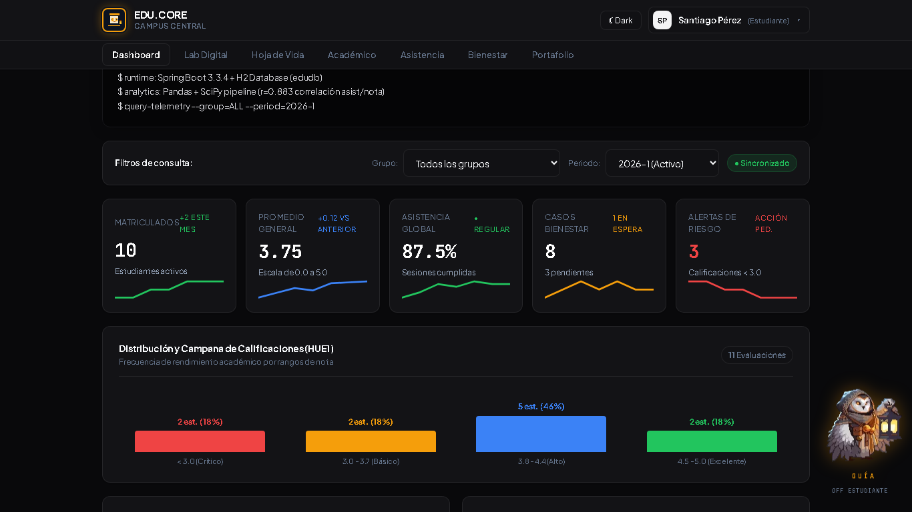
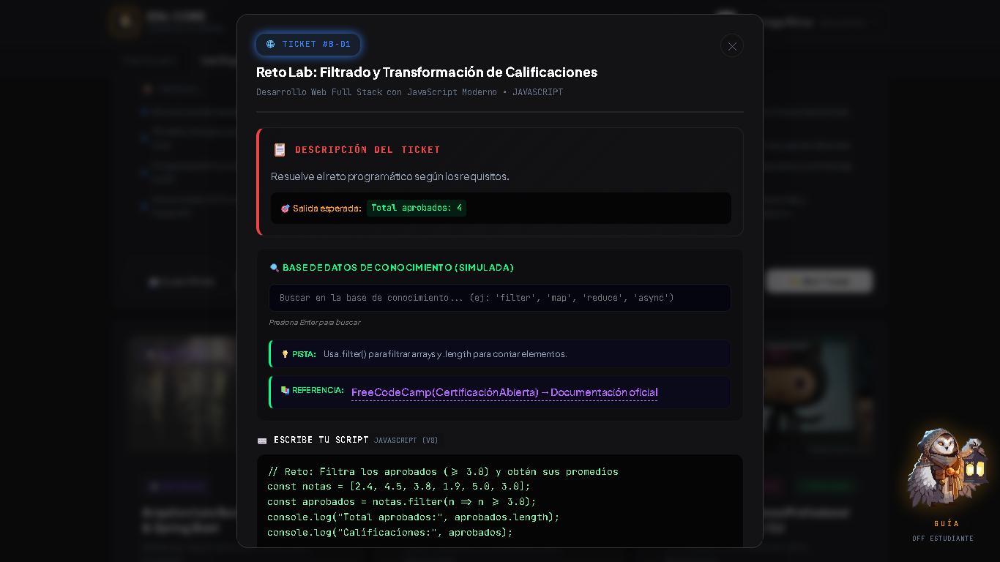

# EDU.CORE · Plataforma de Gestión y Acompañamiento Estudiantil

> App web para gestión académica, asistencia, bienestar y hoja de vida estudiantil.
> Backend **Spring Boot 3.3.4 + Java 17 + H2**, frontend **React 19 + Vite 8**, análisis **Python/Pandas**.

[](https://github.com/Marusan94/plataforma-estudiantil/actions)
[](https://openjdk.org/projects/jdk/17/)
[](https://spring.io/projects/spring-boot)
[](https://react.dev/)
[](https://vitejs.dev/)
[](https://www.h2database.com/)
[]()

---

## Contenido

- [Demo](#demo)
- [El proyecto en breve](#el-proyecto-en-breve)
- [Features](#features)
- [Stack real](#stack-real)
- [Quickstart](#quickstart)
- [API — endpoints reales](#api--endpoints-reales)
- [Estructura](#estructura)
- [Frontend — qué es local y qué es API](#frontend--qué-es-local-y-qué-es-api)
- [Data analysis](#data-analysis)
- [CI/CD y deploy](#cicd-y-deploy)
- [Capturas](#capturas)
- [Demo en video](#demo-en-video)
- [Extensiones naturales](#extensiones-naturales)
- [Contribuir](#contribuir)
- [Licencia](#licencia)

---

## Demo

| Servicio | URL |
|----------|-----|
| Frontend (Render) | `https://educore-frontend.onrender.com` *(ver `render.yaml`; verifica la URL real en tu dashboard de Render)* |
| Backend health | `GET /dashboard/indicadores` |
| H2 Console (solo dev) | `http://localhost:8080/h2-console` (JDBC `jdbc:h2:file:./data/edudb`, user `sa`) |

> Render Free Tier tiene cold start (30–90 s). El health check configurado es `/dashboard/indicadores` (ver `render.yaml`).

---

## Features

- **Dashboard** — KPIs globales (`totalUsuarios`, `promedioGeneral`, `% asistencia`, solicitudes bienestar, distribución por género).
- **Académico** — estudiantes, notas por estudiante/materia/grupo, promedios, bajo rendimiento, ranking, evolución.
- **Asistencia** — planilla por grupo + fecha, registro en lote, % por estudiante, resumen por grupo/mes, generación automática.
- **Bienestar** — necesidades de apoyo (categorías, tipos de apoyo, profesionales, seguimientos, cambio de estado).
- **Familiar** — registro de familiares, vínculos estudiante–familiar, resumen académico y alertas por familiar.
- **Hoja de vida** — perfil + habilidades + proyectos + certificados; exporta a **PDF** (`html2pdf.js`) y **Word** (`docx`) en el navegador; scoring ATS calculado **en frontend** (heurística local, no un estándar ATS).
- **Lab Digital** — 6 cursos con retos de código ejecutados en el navegador (`Function`, sandbox mínimo); progreso guardado en `localStorage`.
- **Cursos / Actividades / Evaluaciones / Biblioteca / Progreso** — CRUDs académicos.
- **Extras UI** — login comercial + modo demo, roles (cambio en navbar), temas `dark`/`light`, portafolio público con toggle Lovecraft (solo CSS), slider de noticias estático, widget mascota con TTS (`speechSynthesis`).

---

## Stack real

Verificado en `backend/pom.xml`, `frontend/package.json`, `application.properties`:

| Capa | Tech |
|------|------|
| Backend | Spring Boot 3.3.4, Java 17, Spring Data JPA, Bean Validation, H2 file `./data/edudb` (`ddl-auto=update`) |
| Frontend | React 19.2.8, Vite 8.2.2, `oxlint`, `html2pdf.js`, `docx`, `file-saver`, `jspdf`, `lucide-react` |
| Análisis | Python 3.12 + pandas/numpy/scipy/matplotlib/seaborn (`data-analysis/`) |
| Infra | `backend/Dockerfile` multi-stage, `render.yaml` (2 servicios), GitHub Actions CI, Dependabot, Trivy → SARIF |

> H2 en archivo `./data/edudb` para desarrollo local con consola habilitada; configuración lista para migrar a PostgreSQL vía `application-prod` cuando se requiera.

---

## El proyecto en breve

**Gestión académica unificada con acompañamiento real**

- **Problema:** notas, asistencia, bienestar y hoja de vida viven en planillas y sistemas separados; coordinarlas quita horas y se pierde seguimiento.
- **Automatización:** API REST por capas (dashboard, académico, asistencia en lote, bienestar, familiar, hoja de vida) + frontend por roles con modo demo offline + analítica Python que genera reportes y gráficas.
- **Resultado:** un solo lugar para registrar, consultar y exportar la vida académica, con Lab Digital para practicar código en el navegador.

`Spring Boot` · `React` · `Python` — [Demo →](https://educore-frontend-co5c.onrender.com) · [Código →](https://github.com/Marusan94/plataforma-estudiantil)

---

## Quickstart

```bash
# Backend (http://localhost:8080)
cd backend
mvn spring-boot:run
# o: mvn -DskipTests package && java -jar target/*.jar

# Frontend (http://localhost:5173)
cd frontend
npm install
npm run dev
# build: npm run build · lint: npm run lint

# Variable de entorno frontend
# VITE_API_URL=https://TU-BACKEND.onrender.com  (vacío = mismo origen + fallback local)
```

El frontend usa `fetchWithFallback(endpoint, options, fallbackData)` (`frontend/src/services/api.js`): intenta la API real con timeout de 3 s y, si falla, usa datos locales. **Sin backend igual arranca en modo demo.**

---

## API — endpoints reales

Fuente: `backend/src/main/java/com/edu/plataforma/controller/*.java`. Sin prefijo global; tal cual están mapeados.

### Sistema / dashboard

| Método | Endpoint |
|--------|----------|
| GET | `/dashboard/indicadores` (también health check) |
| GET | `/estadisticas/asistencia/grupo/{id}`, `/estadisticas/notas/promedio`, `/estadisticas/ranking`, `/estadisticas/evolucion/{idEstudiante}`, `/estadisticas/asistencia-mensual`, `/estadisticas/reportes-bienestar`, `/estadisticas/bajo-rendimiento`, `/estadisticas/graficos-asistencia`, `/estadisticas/resumen-materia`, `/estadisticas/estudiantes-dificultades`, `/estadisticas/familiares/uso`, `/estadisticas/inasistencia-mensual`, `/estadisticas/solicitudes-bienestar-tipo`, `/estadisticas/cohorte`, `/estadisticas/genero`, `/estadisticas/alertas`, `/estadisticas/exportar` |

### Usuarios / estudiantes / docentes

| Método | Endpoint |
|--------|----------|
| POST | `/usuarios`, `/usuarios/login` (`{correo, contrasena}`) |
| GET/PUT/DELETE | `/usuarios`, `/usuarios/{id}`, `/usuarios/rol/{rol}` |
| POST | `/estudiantes` |
| GET | `/estudiantes`, `/estudiantes/{id}`, `/estudiantes/buscar`, `/estudiantes/{id}/resumen-academico` |
| PUT/DELETE | `/estudiantes/{id}` |
| CRUD | `/docentes`, `/docentes/{id}` |

### Perfil / hoja de vida

| Método | Endpoint |
|--------|----------|
| POST/GET | `/perfiles` |
| GET | `/perfiles/{id}`, `/perfil-estudiante/{id}`, `/perfiles/busqueda` |
| PUT/DELETE | `/perfiles/{id}` |
| GET | `/perfiles/{id}/exportar-pdf` |
| POST/DELETE | `/perfiles/{id}/habilidades`, `/habilidades/{id}` |
| POST/PUT | `/perfiles/{id}/proyectos`, `/proyectos/{id}` |
| POST | `/perfiles/{id}/certificados` |

### Notas / asistencia

| Método | Endpoint |
|--------|----------|
| POST | `/notas` |
| GET | `/notas/estudiante/{id}`, `/notas/materia/{materiaId}/grupo/{grupoId}`, `/notas/promedio/estudiante/{id}`, `/notas/bajo-rendimiento`, `/notas/ranking/grupo/{id}`, `/notas/evolucion/estudiante/{id}`, `/notas/docente/{id}` |
| PUT/DELETE | `/notas/{id}` |
| POST | `/asistencias`, `/asistencias/lote`, `/asistencias/generar-automaticas` |
| GET | `/asistencias/estudiante/{id}`, `/asistencias/grupo/{id}?fecha=YYYY-MM-DD`, `/asistencias/porcentaje/estudiante/{id}`, `/asistencias/resumen/grupo/{id}`, `/asistencias/resumen-mes`, `/asistencias/fecha/{fecha}`, `/asistencias/rango` |
| PUT/DELETE | `/asistencias/{id}/estado`, `/asistencias/{id}` |

### Bienestar (`/api`)

| Método | Endpoint |
|--------|----------|
| CRUD | `/api/necesidades`, `/api/necesidades/{id}` |
| GET | `/api/necesidades/estudiante/{id}`, `/api/necesidades/categoria/{id}` |
| POST/PUT | `/api/necesidades/{id}/asignar-profesional`, `/api/necesidades/{id}/estado` |
| POST/GET | `/api/seguimientos`, `/api/necesidades/{id}/seguimientos` |
| POST/GET | `/api/tipos-apoyo`, `/api/categorias-necesidad`, `/api/profesionales` (+ `/{id}`, `/{id}/necesidades`) |
| GET | `/api/reportes/necesidades-tipo` |

### Familiares / vínculos

| Método | Endpoint |
|--------|----------|
| POST | `/familiares`, `/familiares/registro` |
| GET | `/familiares`, `/familiares/{id}`, `/familiares/correo/{email}`, `/familiares/{id}/estudiantes`, `/familiares/{id}/perfil-estudiante`, `/familiares/{id}/notas`, `/familiares/{id}/asistencia`, `/familiares/{id}/alertas`, `/familiares/{id}/solicitudes-bienestar`, `/familiares/{id}/resumen-academico` |
| PUT/DELETE | `/familiares/{id}` |
| CRUD parcial | `/vinculos`, `/vinculos/estudiante/{id}`, `/vinculos/{id}` |

### Cursos / actividades / evaluaciones / biblioteca / progreso (`/api`)

| Método | Endpoint |
|--------|----------|
| CRUD | `/api/cursos`, `/api/cursos/{id}` |
| CRUD | `/api/actividades`, `/api/actividades/{id}` |
| CRUD | `/api/evaluaciones`, `/api/evaluaciones/{id}` |
| CRUD | `/api/biblioteca`, `/api/biblioteca/{id}` |
| POST/GET | `/api/progreso`, `/api/progreso/{id}`, `/api/progreso/estudiante/{id}` |
| PUT/DELETE | `/api/progreso`, `/api/progreso/{id}` |

> Manejo de errores: `GlobalExceptionHandler` + `ErrorResponse`/`ProblemDetail`. Validación con Bean Validation.

---

## Estructura

```
backend/            Spring Boot (controller/service/repository/model/dto/exception/config)
  src/main/java/com/edu/plataforma/
  src/main/resources/application.properties   H2 file, h2-console, multipart 200MB
  Dockerfile        multi-stage maven:3.9.6-temurin-17 → temurin:17-jre-alpine
frontend/           React 19 + Vite (sin TypeScript, sin router; vistas por estado en App.jsx)
  src/components/   14 vistas + NewsSlider + CopilotWidget + Navbar
  src/services/api.js  fetchWithFallback + todos los llamados a la API
data-analysis/      scripts/*.py + run_all_analysis.py --dry-run
.github/workflows/ci.yml   backend-test · frontend-test · data-analysis-test · security-scan · deploy-render
render.yaml         Blueprint: educore-backend (java) + educore-frontend (static)
```

---

## Frontend — qué es local y qué es API

Para no confundir demo con backend:

| Feature | Realidad |
|---------|----------|
| Lab Digital (`getCursosLab`) | Catálogo de 6 cursos con retos que corren en el navegador; sincroniza con `GET /cursos/digitales` y usa datos locales como respaldo offline |
| Actividades por curso (`getActividades`) | Vista por curso con respaldo local; API base `/api/actividades` |
| Progreso (`getProgresoEstudiante`) | Consulta `/api/progreso/estudiante/{id}` con respaldo local |
| ATS Score + asistente IA (HojaVida) | Heurística y respuestas **locales en `HojaVidaView.jsx`**; no hay Gemini/OpenAI ni scoring servidor |
| Noticias (`NewsSlider`) | Contenido estático en el componente |
| Mascotas (`CopilotWidget`) | Lógica local + `speechSynthesis` del navegador |
| Tema Lovecraft | Toggle CSS local (`data-theme` / `portfolio_theme`); el tema global de la app es `dark`/`light` |

---

## Data analysis

```bash
cd data-analysis
pip install pandas numpy scipy matplotlib seaborn
python run_all_analysis.py --dry-run
```

Scripts en `scripts/` + salidas en `reports/` y `data/`. El CI solo valida `py_compile` + dry-run.

---

## CI/CD y deploy

- **CI** (`.github/workflows/ci.yml`): backend `mvn test + package`, frontend `npm ci + lint + build` (`typecheck`/`test` solo `--if-present`, hoy no existen esos scripts), data-analysis `py_compile + --dry-run`, Trivy FS → SARIF, deploy a Render solo en `push` a `main` vía deploy hooks (opcionales por env).
- **Dependabot** (`.github/dependabot.yml`): configurado para el repo.
- **Deploy**: `render.yaml` crea `educore-backend` y `educore-frontend`; tras el primer deploy del backend, fija `VITE_API_URL` en el frontend y haz redeploy. Health check: `/dashboard/indicadores`.

---

## Capturas

| Vista | Captura |
|-------|---------|
| Dashboard + KPIs |  |
| Lab Digital ticket |  |
| Hoja de Vida + exporte |  |

> Para generarlas: abre https://educore-frontend-co5c.onrender.com, captura 1366x768 (dashboard, ticket abierto, hoja de vida) y guarda en `docs/screenshots/`.

## Demo en video

[](docs/demo-educore.mp4)
*Recorrido 90s: login por rol → dashboard → Lab Digital (abrir ticket, ejecutar, acreditar) → Hoja de Vida (exportar PDF/Word).*

> Sube `docs/demo-educore.mp4` a YouTube/Loom y reemplaza este link por la URL pública.

---

## Extensiones naturales

- Suite de pruebas backend (JUnit/Mockito) y frontend (Vitest/RTL) con cobertura en CI
- Endpoint `GET /cursos/digitales` servido por backend para unificar Lab Digital con `/api/cursos`
- Perfil `application-prod` con PostgreSQL + migraciones versionadas
- Autenticación con hash + JWT y autorización por rol en backend
- E2E (Playwright) del flujo login → ticket → exporte

---

## Contribuir

```bash
git checkout -b feat/mi-cambio
# backend: mvn test · frontend: npm run lint && npm run build
git commit -m "feat(scope): descripción corta"
# abre PR — el template está en .github/PULL_REQUEST_TEMPLATE.md
```

---

## Licencia

Uso institucional — propiedad de EDU.CORE. Ver `SECURITY.md` para reportar vulnerabilidades.
