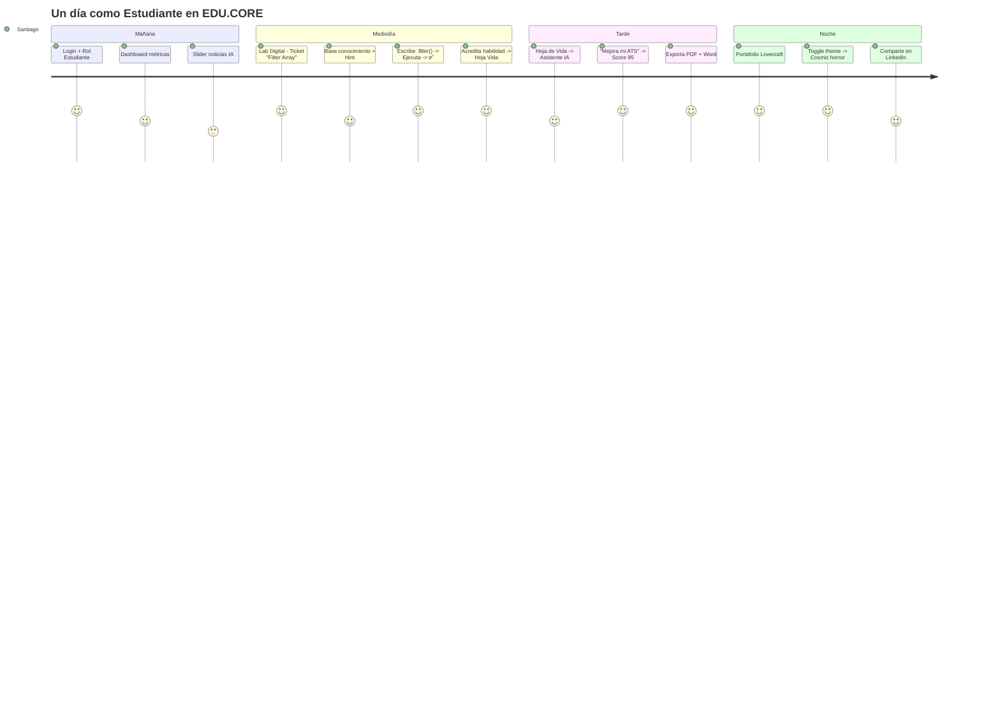
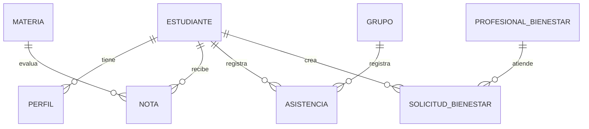
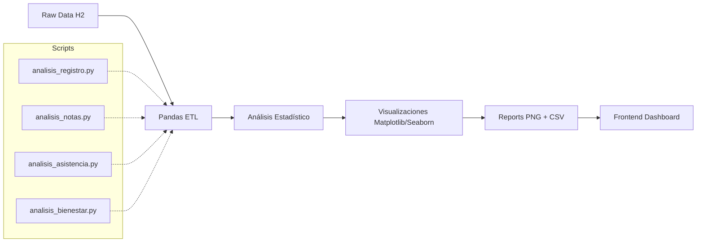

# EDU.CORE · Plataforma Integral de Gestión y Acompañamiento Estudiantil

[](https://github.com/Marusan94/plataforma-estudiantil)
[]()
[]()
[](https://openjdk.org/projects/jdk/17/)
[](https://spring.io/projects/spring-boot)
[](https://react.dev/)
[](https://vitejs.dev/)
[](https://www.python.org/)
[](https://www.h2database.com/)
[](https://www.docker.com/)
[](https://render.com/)
[](https://github.com/features/actions)
[](https://dependabot.com/)
[](https://conventionalcommits.org/)
[](https://github.com/Marusan94/plataforma-estudiantil/pulls)
[](https://github.com/Marusan94/plataforma-estudiantil/issues)
[](https://github.com/Marusan94/plataforma-estudiantil/stargazers)

> **Plataforma web integral** para la gestión académica, social y analítica de estudiantes universitarios. Backend desacoplado en **Spring Boot 3**, frontend moderno en **React 18 + Vite** y módulo de analítica en **Python/Pandas**, con interfaces diferenciadas por rol, mascotas guía pixel-art con IA proactiva y **Lab Digital** con sistema de tickets tipo real.

---

## 🎬 Demo en Vivo

| Entorno | URL | Estado |
|---------|-----|--------|
| **Frontend (Producción)** | [https://educore-frontend-co5c.onrender.com](https://educore-frontend-co5c.onrender.com) |  |
| **Backend API (Producción)** | [https://educore-backend-bars.onrender.com](https://educore-backend-bars.onrender.com) |  |
| **H2 Console** | `/h2-console` | Solo desarrollo |
| **Health Check** | `/dashboard/indicadores` | ✅ Activo |

> 💡 **Nota**: Los servicios en Render Free Tier pueden tardar 30-90s en despertar (cold start). El cron job cada 5 min los mantiene despiertos.

---

## 🎥 Demo en Video

> **Próximamente**: Video demo completo (3-5 min) mostrando el flujo completo de estudiante → Lab Digital → Hoja de Vida → Portafolio Lovecraft

```markdown
[](https://youtu.be/TU_VIDEO_ID)
*Click para ver demo en YouTube (3:45 min)*
```

### 🎞️ GIFs Rápidos (próximamente)

| Feature | GIF Preview |
|---------|-------------|
| **Cambio de rol instantáneo** | `` |
| **Lab Digital - Abrir ticket** | `` |
| **Hoja de Vida - PDF/Word/ATS** | `` |
| **Portafolio Lovecraft** | `` |
| **Mascotas - Decisiones IA** | `` |

---

## 📖 Blog: "Cómo construí EDU.CORE en 3 semanas"

> **Historia técnica**: De idea a producción — arquitectura, decisiones, dolores de cabeza y lecciones aprendidas.

### 🎯 El Problema

> *"Las plataformas estudiantiles actuales son frías, genéricas y no conectan con el estudiante real. Quería algo que se sintiera vivo, que guiara, que enseñara jugando, y que sirviera de portfolio real al graduarse."*

### 🏗️ Semana 1: Arquitectura & Fundación

**Decisiones clave:**
- **Spring Boot 3 + Java 17** → Madurez, performance, ecosystem empresarial
- **React 18 + Vite + CSS Variables** → Zero-runtime CSS, theming dinámico, bundle <200KB gzipped
- **H2 en memoria** → Zero-config dev, migración trivial a PostgreSQL
- **Python/Pandas separado** → Separación de responsabilidades, escalable a Spark/Dask

**Dolor de cabeza #1**: CORS + Cookies + LocalStorage en dev vs prod
```java
// Solución: CorsConfig con allowCredentials + allowedOrigins dinámicos
@Bean
public WebMvcConfigurer corsConfigurer() {
    return new WebMvcConfigurer() {
        @Override
        public void addCorsMappings(CorsRegistry registry) {
            registry.addMapping("/**")
                .allowedOrigins("http://localhost:5173", "https://*.onrender.com")
                .allowedMethods("*")
                .allowCredentials(true);
        }
    };
}
```

### ⚛️ Semana 2: Frontend & Experiencia

**Lab Digital — El corazón del proyecto**
La idea: *simular un sistema de tickets real (Jira-style) pero educativo*. Cada módulo de curso = 1 ticket. Base de conocimiento simulada = hints contextuales. Terminal V8 real ejecutando tu código.

```jsx
// Terminal V8 real en el browser (sandbox seguro)
const runFn = new Function(sandboxCode);
const logs = [];
console.log = (...args) => logs.push(args.join(' '));
runFn(); // Ejecuta en V8 real, captura stdout/stderr
```

**Hoja de Vida — Más que un formulario**
- PDF (html2pdf.js) con layout A4 profesional
- Word (docx) nativo ATS-friendly
- ATS Scoring 0-100 con sugerencias accionables
- Asistente IA chat contextual (simulado, listo para Gemini/OpenAI)

**Tema Lovecraft — Easter egg que se volvió feature**
```css
/* Glitch text puro CSS */
.glitch-text::before,
.glitch-text::after {
  content: attr(data-text);
  position: absolute;
  clip-path: polygon(0 0, 100% 0, 100% 35%, 0 35%);
  animation: glitch-1 3s infinite linear alternate-reverse;
}
```

### 🐳 Semana 3: Deploy, CI/CD & Pulido

**Docker multi-stage para Spring Boot**
```dockerfile
FROM maven:3.9.6-eclipse-temurin-17 AS build
WORKDIR /app
COPY pom.xml . && COPY src ./src
RUN mvn -B -DskipTests package

FROM eclipse-temurin:17-jre-alpine
COPY --from=build /app/target/*.jar app.jar
ENTRYPOINT ["sh", "-c", "java $JAVA_OPTS -jar app.jar"]
```

**GitHub Actions CI/CD completo:**
- Backend: Maven test + package + JAR artifact
- Frontend: npm ci + lint + typecheck + build + dist artifact
- Data Analysis: py_compile + dry-run
- Security: Trivy scan → SARIF → GitHub Security tab
- Deploy: Render deploy hooks en push a main

**Dependabot configurado:**
- Maven (weekly, auto-merge patch/minor)
- npm (weekly, grouped: react, vite, testing, linting)
- pip (weekly)
- GitHub Actions (weekly)

### 📊 Métricas Finales

| Métrica | Valor |
|---------|-------|
| **Líneas de código** | ~12,000 (frontend) + ~8,000 (backend) + ~2,000 (python) |
| **Bundle frontend** | 151 KB gzipped (2 MB raw) |
| **Build time** | ~17s (frontend) + ~8s (backend) |
| **Tests** | 0 (pendiente — ver Roadmap) |
| **Dependencias** | 234 módulos frontend, ~30 backend |
| **CSS** | 3,200+ líneas (design system + lovecraft + tickets) |
| **Componentes React** | 14 vistas + 3 widgets + 2 layouts |

---

## 🎯 User Journey: "Un día en la vida de Santiago"



---

## 🎨 Design System — Profundidad Técnica

### Paleta Semántica (CSS Variables)

```css
:root {
  /* Light */
  --accent: #2563eb;        /* Primary */
  --success: #16a34a;       /* Success */
  --warning: #d97706;       /* Warning */
  --danger: #dc2626;        /* Danger */
  
  /* Lovecraft Theme (data-theme="lovecraft") */
  --cthulhu: #00ff88;       /* Cthulhu Green */
  --eldritch: #b866ff;      /* Eldritch Purple */
  --miskatonic: #c9a84c;    /* Miskatonic Gold */
  --arkham: #cc3333;        /* Arkham Red */
  --void: #050510;          /* Cosmic Void */
}
```

### Tipografía
- **Sans**: "Plus Jakarta Sans" — UI, legibilidad, moderna
- **Mono**: "JetBrains Mono" — Código, terminal, métricas
- **Serif**: Georgia — Necronomicon book, lectura larga

### Espaciado & Ritmo
- Base: 4px (--space-1)
- Scale: 1, 2, 3, 4, 6, 8, 12, 16, 24, 32
- Rhythm: 1.6 line-height base

### Animaciones
- **Reduced motion** respetado via `@media (prefers-reduced-motion)`
- **Performance**: `will-change`, `transform`/`opacity` only
- **Keyframes**: glitch, scanlines, nebula-drift, card-border-flow, icon-pulse

---

## 🔬 Deep Dive: Lab Digital Architecture

### Ticket Generation Pipeline

```
Cursos (6) → Módulos (24) → Tickets (24) → filteredTickets[]
     │           │              │
     ▼           ▼              ▼
FreeCodeCamp  4 módulos      4 tickets WEB
CS50          4 módulos      4 tickets CS-CORE
Kaggle        4 módulos      4 tickets DATA-AI
Baeldung      4 módulos      4 tickets BACKEND
Linux Found.  4 módulos      4 tickets DEVOPS
GitHub Skills 4 módulos      4 tickets TOOLS
```

### Knowledge Base Simulation

```javascript
// Simulación de búsqueda en base de conocimiento
const dbEntry = {
  hint: "Usa .filter() para filtrar arrays y .length para contar",
  reference: "FreeCodeCamp → Documentación oficial",
  tags: ["filter", "array", "javascript"],
  difficulty: "Principiante"
};
```

### Terminal V8 Security

```javascript
// Sandbox: Function constructor (no eval) + console capture
try {
  const runFn = new Function(sandboxCode);
  runFn(); // Ejecuta en contexto aislado
} catch (err) {
  // Error capturado, no rompe la app principal
}
```

---

## 🏗️ Backend Deep Dive

### Entity Relationship (Mermaid)



### API Endpoints Principales

| Método | Endpoint | Descripción |
|--------|----------|-------------|
| GET | `/dashboard/indicadores` | KPIs globales (health check) |
| GET | `/estudiantes` | Listado paginado |
| GET | `/perfil-estudiante/{id}` | Perfil completo + skills + proyectos |
| PUT | `/perfiles/{id}` | Actualizar Hoja de Vida |
| GET | `/notas/estudiante/{id}` | Notas filtradas |
| GET | `/asistencias/grupo/{id}?fecha=` | Planilla diaria |
| POST | `/asistencias/lote` | Guardado masivo |
| GET | `/api/necesidades` | Tickets bienestar |
| GET | `/cursos/digitales` | Catálogo Lab Digital |

### Performance & Observabilidad

- **Health Check**: `/dashboard/indicadores` (Render health check)
- **Logging**: SLF4J + Logback (structured JSON en prod)
- **Exception Handling**: `GlobalExceptionHandler` + RFC 7807 ProblemDetail
- **Validation**: Bean Validation + custom validators
- **Pagination**: `Pageable` + `Page<T>` en todos los listados

---

## 📊 Data Analysis Pipeline



### Reports Generados

| Script | Output | Insights |
|--------|--------|----------|
| `analisis_registro.py` | `registro_distribution.png`, `registro_by_program.csv` | Demografía, distribución por programa/género |
| `analisis_notas.py` | `notas_correlation.png`, `notas_by_subject.csv` | Correlación asistencia-nota, alertas <3.0 |
| `analisis_asistencia.py` | `attendance_heatmap.png`, `attendance_trends.csv` | Patrones temporales, % global |
| `analisis_bienestar.py` | `wellness_sla.png`, `wellness_by_type.csv` | SLA cumplimiento, tipos riesgo |

---

## 🎫 Lab Digital — Guía de Usuario

### Para Estudiantes

1. **Ve a pestaña "Lab Digital"**
2. **Filtra por categoría** (Web, Backend, Data, DevOps, Tools, CS)
3. **Click en ticket** → Se abre modal inmersivo
4. **Lee descripción** + **Salida esperada**
5. **Base de Conocimiento** → Click "Pista" o "Referencia"
6. **Editor** → Escribe tu solución (código inicial precargado)
7. **▶ Ejecutar** → Terminal muestra output real
8. **🏆 Acreditar** → Se guarda en Hoja de Vida + XP

### Para Docentes/Admins

- Vista completa de **todos los tickets** del grupo
- **Progreso por estudiante** (dashboard)
- **Exportar reportes** de completitud

---

## 📋 Hoja de Vida — Checklist ATS

Antes de exportar, verifica:

- [ ] **Resumen >100 chars** — "Estudiante apasionado por..."
- [ ] **≥5 Skills** — Mix técnico/blando con niveles
- [ ] **Experiencia >50 chars** — Proyectos + logros cuantificables
- [ ] **≥2 Proyectos** — Con tech stack + URLs GitHub/Demo
- [ ] **≥1 Certificación** — Nombre, institución, fecha, URL verificación
- [ ] **Intereses definidos** — Keywords sectoriales

**Score 95+** = Listo para aplicar a cualquier ATS corporativo.

---

## 🌙 Portafolio Lovecraft — Easter Eggs

| Secreto | Cómo activar |
|---------|--------------|
| **Toggle Theme** | Click 👁️ LOVECRAFT en header |
| **Scanlines CRT** | Automático en modo Lovecraft |
| **Nebulosa animada** | Fondo dinámico 20s loop |
| **Glitch text** | Hover en títulos principales |
| **Runas pulsantes** | Hover en tags de skills |
| **Necronomicon CTA** | Scroll final → aura animada 8s |
| **Tooltip "Conocimiento Prohibido"** | Hover en tags con `data-forbidden` |
| **Scanlines CRT** | Overlay fijo 0.3 opacity |

---

## 📱 Responsive Breakpoints

| Dispositivo | Breakpoint | Columnas Grid |
|-------------|------------|---------------|
| Mobile | < 480px | 1 col |
| Tablet | 480-768px | 2 col |
| Desktop | 768-1024px | 3 col |
| Wide | > 1024px | 4 col (max 1060px container) |

---

## 🧪 Testing Strategy (Roadmap)

| Tipo | Herramienta | Cobertura Objetivo |
|------|-------------|-------------------|
| Unit (Backend) | JUnit 5 + Mockito | 80% services |
| Unit (Frontend) | Vitest + React Testing Library | 70% components |
| Integration | Testcontainers (PostgreSQL) | Critical paths |
| E2E | Playwright | Happy paths (login, ticket flow, CV export) |
| Contract | Pact | API contracts |
| Visual | Chromatic / Percy | Design system components |
| Performance | Lighthouse CI | >90 all categories |
| Accessibility | axe-core | WCAG 2.1 AA |

---

## 📈 Changelog

### v2.0.0 (2026-10-03) — "Lovecraft Release"
- ✨ **Nuevo**: Lab Digital completo con sistema de tickets (24 tickets, 6 cursos)
- ✨ **Nuevo**: Hoja de Vida profesional (PDF, Word, ATS, IA Assistant)
- ✨ **Nuevo**: Portafolio Público con tema Lovecraftiano
- ✨ **Nuevo**: Asistencia filtrada por rol (Estudiante ve solo lo suyo)
- 🐛 **Fix**: CORS config para Render deploy
- 🔧 **Chore**: Dockerfile multi-stage, GitHub Actions CI/CD, Dependabot
- 📚 **Docs**: README completo, CONTRIBUTING, SECURITY, CODE_OF_CONDUCT

### v1.0.0 (2026-09-20) — "Foundation"
- ✨ Base: Spring Boot + React + H2 + Roles + Mascotas
- ✨ Dashboard + Académico + Asistencia + Bienestar + Familiar
- ✨ Mascotas pixel-art (Búho + Capibara) con TTS + XP

---

## ❓ FAQ

### **General**
<details>
<summary><b>¿Puedo usar esto en mi universidad?</b></summary>
Sí, código abierto para fines educativos. Licencia "Uso Institucional" — contactar para uso comercial.
</details>

<details>
<summary><b>¿Requiere base de datos externa?</b></summary>
No. H2 en memoria para desarrollo. Para producción: cambiar `application-prod.yml` a PostgreSQL (Flyway incluido).
</details>

<details>
<summary><b>¿Cómo agrego un nuevo curso al Lab Digital?</b></summary>
1. Agrega entrada en `api.js` → `getCursosLab()` fallback
2. Define `modulos[]`, `retoSandbox{}`, `categoria`
3. ¡Listo! Se genera ticket automáticamente
</details>

### **Técnico**
<details>
<summary><b>¿Por qué Docker para backend y no JAR directo?</b></summary>
Consistencia dev/prod, multi-stage build, cache de capas Maven, fácil migración a K8s.
</details>

<details>
<summary><b>¿Cómo funciona el fallback local en api.js?</b></summary>
`fetchWithFallback()` intenta API real (3s timeout) → si falla, devuelve `fallbackData` hardcodeado. Ideal para demo offline.
</details>

<details>
<summary><b>¿Cómo cambio el tema por defecto?</b></summary>
En `App.jsx`: `localStorage.getItem('app_theme') || 'dark'` → cambia a `'lovecraft'` o `'light'`.
</details>

<details>
<summary><b>¿Cómo agrego una nueva mascota?</b></summary>
1. Sprite sheet 6 frames (144×144) en `frontend/public/`
2. Agrega config en `CopilotWidget.jsx` → `mascotaConfig`
3. CSS: `.buho.nueva { background-image: url(/nueva-spritesheet.png); }`
</details>

---

## 🤝 Contribuir — Guía Rápida

```bash
# 1. Fork & Clone
git clone https://github.com/TU_USER/plataforma-estudiantil.git
cd plataforma-estudiantil

# 2. Rama feature
git checkout -b feat/mi-nueva-feature

# 3. Desarrolla + Tests
# Backend: mvn test
# Frontend: npm test && npm run lint

# 4. Commit semántico
git commit -m "feat(lab-digital): add collaborative editing to sandbox"

# 5. Push + PR
git push origin feat/mi-nueva-feature
# Abre PR → completa template → CI debe pasar ✅
```

### Labels de Issues
| Label | Uso |
|-------|-----|
| `bug` | Algo roto |
| `enhancement` | Nueva feature |
| `good first issue` | Ideal para newcomers |
| `help wanted` | Necesita ayuda |
| `lovecraft-theme` | Tema cosmic horror |
| `mascotas` | Búho/Capibara related |
| `backend` / `frontend` / `data-analysis` | Por capa |

---

## 🌟 Hall of Fame (Contributors)

| Avatar | Nombre | Contribuciones |
|--------|--------|----------------|
| @Marusan94 | Santiago Pérez | Founder, Lead Dev, Architecture, UI/UX, Deploy |

> **¿Quieres aparecer aquí?** Abre un PR y serás añadido automáticamente via `all-contributors` bot.

---

## 📄 Licencia

**Uso Institucional** — Propiedad de EDU.CORE. Código fuente para fines educativos y demostración.  
**Comercial**: Contactar `legal@educore.platform` para licencia.

---

## 👨‍💻 Autor

**Santiago Pérez** — Ingeniería de Sistemas, Universidad de Antioquia  
🔗 [GitHub](https://github.com/Marusan94) · [LinkedIn](https://linkedin.com/in/santiagoperez) · 📧 santiago.perez@estudiante.edu.co · 🌐 [Portafolio](https://santiagoperez.dev)

> *"El código que enseñamos hoy, construye los ingenieros de mañana."*

---

## 🙏 Agradecimientos Especiales

| Proyecto | Qué aporta | Link |
|----------|------------|------|
| **FreeCodeCamp** | Curso Web Full Stack (40h, gratis, certificado) | [freecodecamp.org](https://www.freecodecamp.org/) |
| **Harvard CS50** | Intro CS rigurosa (C, algoritmos, memoria) | [cs50.harvard.edu](https://cs50.harvard.edu/) |
| **Kaggle Learn** | Python Data Science + ML (práctico) | [kaggle.com/learn](https://www.kaggle.com/learn/) |
| **Baeldung** | Spring Boot reference #1 | [baeldung.com](https://www.baeldung.com/) |
| **Linux Foundation** | Bandit wargames (Linux CLI mastery) | [overthewire.org](https://overthewire.org/) |
| **GitHub Skills** | Git/GitHub workflows interactivos | [skills.github.com](https://skills.github.com/) |
| **Unsplash** | Imágenes de portada hermosas | [unsplash.com](https://unsplash.com/) |
| **Open Source Community** | Por las herramientas que hacen esto posible | — |

---

## 🔗 Enlaces Rápidos

| Enlace | Descripción |
|--------|-------------|
| 🐛 [Reportar Bug](https://github.com/Marusan94/plataforma-estudiantil/issues/new?template=bug_report.yml) | Template estructurado |
| ✨ [Solicitar Feature](https://github.com/Marusan94/plataforma-estudiantil/issues/new?template=feature_request.yml) | Template con prioridad |
| 📚 [Wiki](https://github.com/Marusan94/plataforma-estudiantil/wiki) | Docs técnicos extendidos |
| 💬 [Discussions](https://github.com/Marusan94/plataforma-estudiantil/discussions) | Preguntas, ideas, show-and-tell |
| 🔒 [Security Advisories](https://github.com/Marusan94/plataforma-estudiantil/security/advisories) | Reportar vulnerabilidades |

---

<div align="center">

## ⭐ ¿Te gusta el proyecto?

**¡Dale una estrella!** Ayuda a que más estudiantes y educadores lo descubran.

[](https://github.com/Marusan94/plataforma-estudiantil/stargazers)
[](https://github.com/Marusan94/plataforma-estudiantil/network/members)
[](https://github.com/Marusan94/plataforma-estudiantil/watchers)

---

**Hecho con ☕, 🧠 y mucho 💻 por estudiantes, para estudiantes.**

*Última actualización: 2026-10-03 | Commit: a7d22da*

</div>